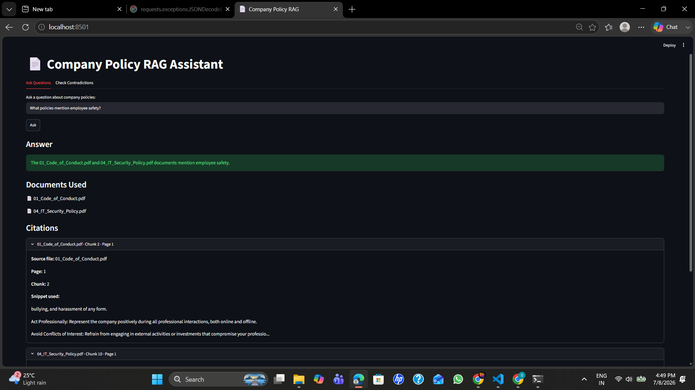
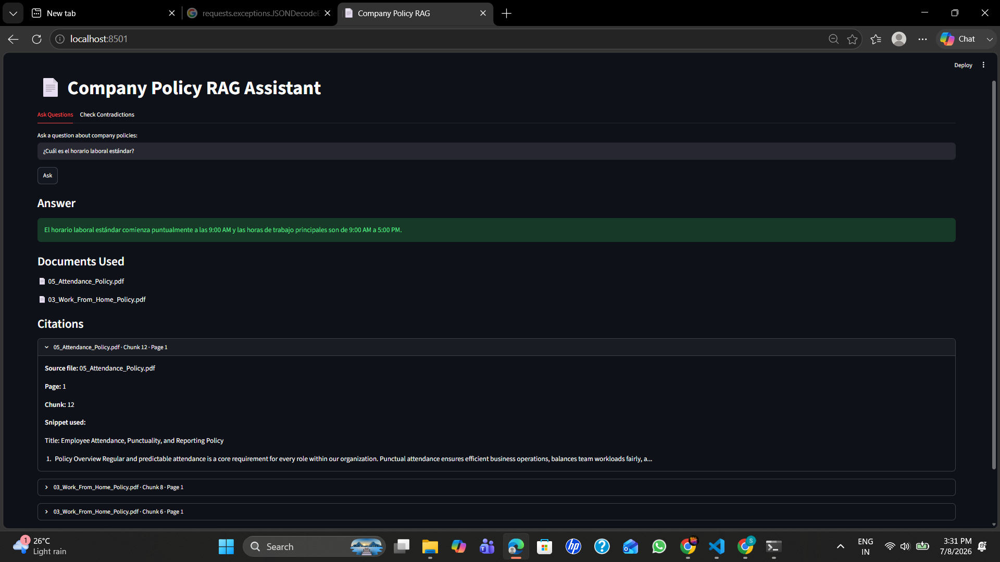
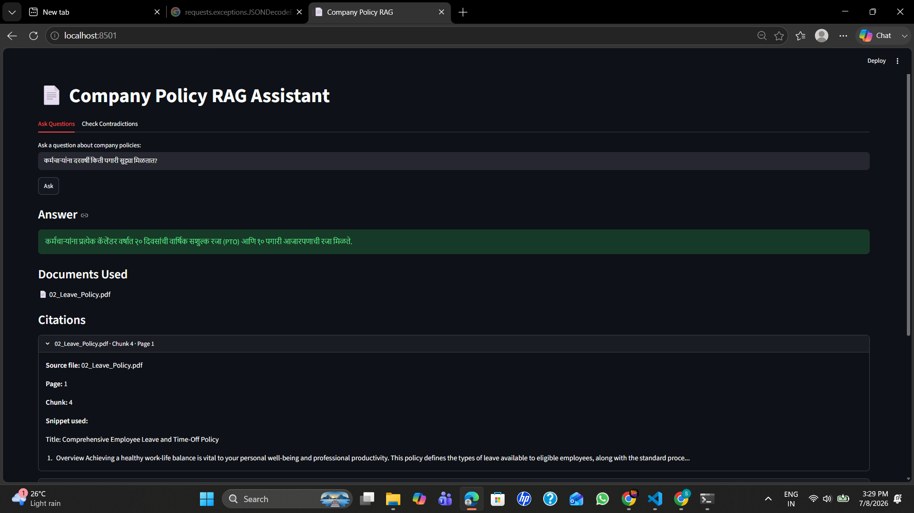
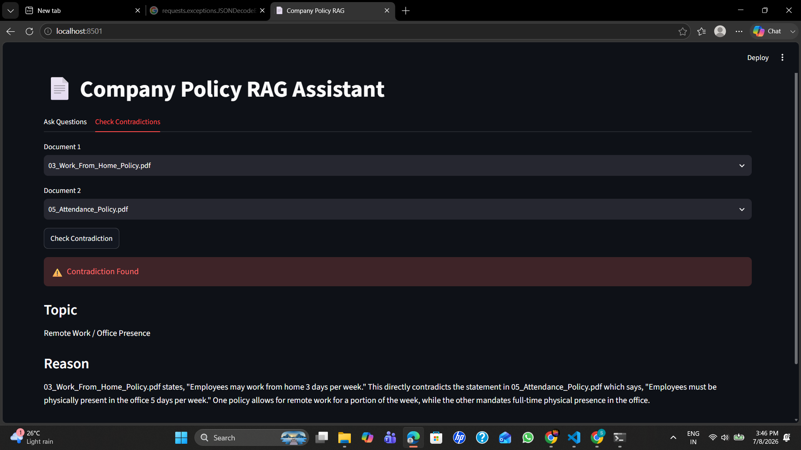
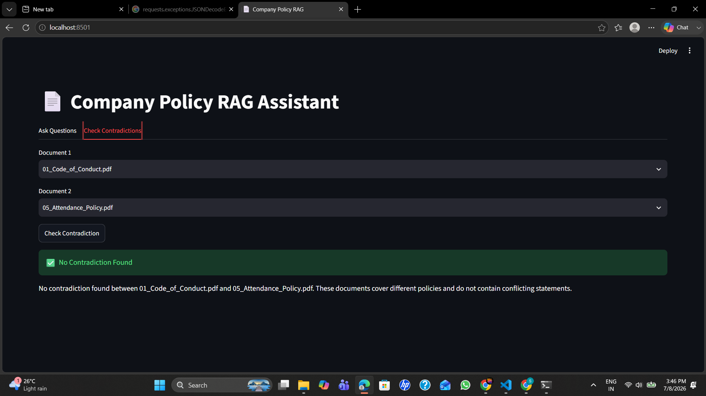

# 📄 Company Policy RAG Assistant

> Potens AI/ML Internship Assignment – Question 1: Document Q&A with Citations - Time Started at: 8:00 pm. Finished at: 6:30 pm 

## Overview

This project implements a **Retrieval-Augmented Generation (RAG)** system over multiple company policy documents.

Instead of relying on the language model's internal knowledge, the system retrieves the most relevant document chunks from a vector database and provides those chunks as context to Gemini. The generated answer is therefore grounded in the uploaded documents rather than hallucinated knowledge.

The application also includes:

* Semantic document search
* Source citations
* Contradiction detection between policy documents
* Multilingual question answering using **translation at the boundary**
* FastAPI backend
* Streamlit frontend

---

# Problem Statement

The objective was to build a RAG application over at least five documents that:

* Answers questions using only the uploaded documents.
* Returns citations showing where the answer came from.
* Detects contradictory information between documents.
* Supports multilingual queries.
* Prevents hallucinations by restricting answers to retrieved context.

---

# Features

* PDF document ingestion
* Recursive document chunking
* Sentence Transformer embeddings
* ChromaDB vector database
* Semantic similarity search
* Retrieval-Augmented Generation (Gemini 2.5 Flash)
* Evidence-based answers
* Source citations
* Contradiction detection
* Translation at the boundary
* FastAPI REST API
* Streamlit UI

---

# Tech Stack

| Component       | Technology                     |
| --------------- | ------------------------------ |
| Language        | Python                         |
| LLM             | Gemini 2.5 Flash               |
| Embeddings      | BAAI/bge-small-en-v1.5         |
| Vector Database | ChromaDB                       |
| Framework       | LangChain                      |
| Backend         | FastAPI                        |
| Frontend        | Streamlit                      |
| PDF Loader      | PyPDFLoader                    |
| Chunking        | RecursiveCharacterTextSplitter |

---

# Project Structure

```text
.
├── app.py                  # Streamlit frontend
├── main.py                 # FastAPI server
├── requirements.txt
│
├── data
│   ├── documents
│   └── chroma_db
│
├── src
│   ├── loader.py
│   ├── splitter.py
│   ├── embeddings.py
│   ├── ingest.py
│   ├── retrieval.py
│   ├── rag.py
│   ├── prompts.py
│   ├── llm.py
│   ├── contradiction.py
│   └── translator.py
│
└── README.md
```

---

# System Architecture

```text
                  PDF Documents
                        │
                        ▼
                 Load Documents
                        │
                        ▼
                Recursive Chunking
                        │
                        ▼
            Sentence Transformer Embeddings
                        │
                        ▼
                  Chroma Vector DB
                        │
          ┌─────────────┴─────────────┐
          │                           │
          ▼                           ▼
      User Question           Contradiction Check
          │                           │
          ▼                           ▼
 Translation at Boundary        Load Two PDFs
          │                           │
          ▼                           ▼
 Semantic Retrieval              Gemini Analysis
          │
          ▼
 Retrieved Chunks
          │
          ▼
 Prompt + Gemini
          │
          ▼
 Answer + Citations
```

---

# Implementation Details

## 1. Document Loading

The application first loads all PDF files using LangChain's **PyPDFLoader**.

Each page is stored with metadata including:

* source file
* page number

Metadata is preserved throughout the pipeline so citations can be generated later.

---

## 2. Document Chunking

Large documents cannot be embedded efficiently as a single block.

Therefore each page is divided using:

* RecursiveCharacterTextSplitter
* Chunk Size: 500 characters
* Chunk Overlap: 100 characters

Overlap prevents important information from being split between two chunks.

Each chunk receives:

* source
* page
* chunk_id

---

## 3. Embedding Generation

Each chunk is converted into a dense vector using:

**BAAI/bge-small-en-v1.5**

Reasons for choosing this model:

* lightweight
* open-source
* strong semantic retrieval performance
* fast inference
* no API cost

---

## 4. Vector Database

All embeddings are stored inside ChromaDB.

The database persists locally.

```
PDF
   ↓
Chunk
   ↓
Embedding
   ↓
ChromaDB
```

This allows retrieval without recomputing embeddings.

---

## 5. Semantic Retrieval

When the user asks a question:

```
How many vacation days do employees receive?
```

The question is embedded using the same embedding model.

Similarity search retrieves the most relevant chunks.

Top **k = 3** chunks are returned.

Only retrieved chunks are passed to Gemini.

---

## 6. Retrieval-Augmented Generation

Retrieved chunks are formatted into context:

```
Source:
Page:
Chunk:

Content:
...
```

The prompt instructs Gemini to:

* answer only from context
* never hallucinate
* mention document names
* provide evidence
* admit when information is unavailable

This significantly reduces fabricated answers.

---

## 7. Citation Generation

Every retrieved chunk retains metadata.

After Gemini identifies which documents were used, citations are generated containing:

* source filename
* page number
* chunk number
* supporting snippet

Example:

```
02_Leave_Policy.pdf

Page: 1

Chunk: 4

Snippet:
Annual Paid Time Off (PTO):
Full-time employees accrue 20 days of paid vacation annually...
```

This allows users to verify every answer.

---

## 8. Contradiction Detection

Users may select any two policy documents.

Both documents are loaded completely.

Gemini compares them and returns JSON.

Example:

```json
{
    "conflict": true,
    "topic": "Remote Work",
    "reason": "Work_From_Home_Policy.pdf allows employees to work from home three days per week while Attendance_Policy.pdf requires physical office presence five days per week."
}
```

If no contradiction exists:

```json
{
    "conflict": false,
    "reason": "No contradiction found between the selected documents."
}
```

---

## 9. Multilingual Support

Although the document corpus is stored entirely in English, the application supports multilingual queries.

The implementation combines translation at the boundary with Gemini's multilingual capabilities.

**Translation at the Boundary**

Before retrieval, the system:

Detects the language of the user's question.
Translates non-English queries into English.
Performs semantic retrieval over the English vector database.
Generates the answer using the retrieved English context.
Translates the final answer back to the user's original language.

This approach ensures that retrieval is always performed in a single embedding space, avoiding duplicate vector databases for different languages.

```
User Question (Any Language)
            │
            ▼
Language Detection
            │
            ▼
Translate to English
            │
            ▼
Vector Search (English)
            │
            ▼
Retrieved Context
            │
            ▼
Gemini Answer Generation
            │
            ▼
Translate Answer Back
            │
            ▼
            User
```

**Gemini Multilingual Capability**

Gemini natively understands and generates responses in many languages. During development, it was observed that Gemini could correctly answer questions written in languages such as Spanish, Portuguese, Japanese, and Chinese even without explicit translation.

However, queries written in some scripts (such as Hindi, Marathi in Devanagari) produced less reliable retrieval results because the embedding model and vector database were built on English documents.

Therefore, explicit translation at the boundary was implemented to make retrieval language-independent and provide consistent behaviour across all supported languages.

*Why this approach?*

This hybrid design provides two advantages:

Reliable retrieval by searching only over English embeddings.
Natural multilingual interaction by allowing users to ask questions in their preferred language.

Even though Gemini has strong multilingual capabilities, boundary translation ensures that the retrieval stage remains accurate and deterministic, rather than relying solely on the language model's internal translation abilities.

---

## 10. Backend

FastAPI exposes REST APIs.

### POST /ask

Input

```json
{
    "question":"How many vacation days do employees receive?"
}
```

Output

```json
{
    "answer":"Full-time employees receive 20 paid vacation days annually.",
    "documents_used":[
        "02_Leave_Policy.pdf"
    ],
    "citations":[
        ...
    ]
}
```

---

### POST /contradict

Input

```json
{
    "doc1":"03_Work_From_Home_Policy.pdf",
    "doc2":"05_Attendance_Policy.pdf"
}
```

Output

```json
{
    "conflict":true,
    "topic":"Remote Work",
    "reason":"..."
}
```

---

# Frontend

The Streamlit interface contains two tabs.

## Ask Questions

Allows users to:

* ask policy questions
* receive grounded answers
* view citations

---

## Check Contradictions

Allows users to:

* select two documents
* compare them
* view contradiction analysis

---

# Example Queries

### English

```
How many paid vacation days do employees receive?
```

### Hindi

```
कर्मचारियों को कितने दिन की पेड छुट्टी मिलती है?
```

### Spanish

```
¿Cuántos días de vacaciones pagadas reciben los empleados?
```

### Portuguese

```
Os funcionários podem trabalhar em casa?
```

---

# Design Decisions

### Why ChromaDB?

* lightweight
* local persistence
* simple integration with LangChain

---

### Why BGE Embeddings?

Higher semantic retrieval quality than basic embedding models while remaining lightweight enough for local execution.

---

### Why Translation at the Boundary?

Embedding every language separately would duplicate storage and reduce retrieval consistency.

Boundary translation keeps a single English knowledge base while supporting multilingual users.

---

### Why Retrieval-Augmented Generation?

Pure LLMs hallucinate.

RAG forces answers to come from retrieved evidence.

---

# Limitations

* Retrieval quality depends on chunking strategy.
* OCR-based scanned PDFs are not supported.
* Contradiction detection depends on LLM reasoning.
* Very large document collections would require better indexing.

---

# Future Improvements

* Hybrid Retrieval (BM25 + Dense Retrieval)
* Cross-Encoder Re-ranking
* Streaming responses
* Conversation memory
* Highlight cited text directly inside PDFs
* Support DOCX and HTML
* User authentication
* Incremental document ingestion

---

# How to Run

## Install

```bash
pip install -r requirements.txt
```

Create a `.env` file:

```text
GOOGLE_API_KEY=YOUR_API_KEY
```

---

## Create Vector Database

```bash
python ingest.py
```

---

## Start Backend

```bash
uvicorn main:app --reload
```

---

## Start Frontend

```bash
streamlit run app.py
```

---

# AI Use Log

| Tool                    | Approximate Usage | Purpose                                                                                                                                                                      |
| ----------------------- | ----------------- | ---------------------------------------------------------------------------------------------------------------------------------------------------------------------------- |
| ChatGPT (GPT-5.5)       | ~70-80 prompts | Brainstorming architecture, debugging LangChain integration, prompt engineering, multilingual workflow, citation improvements, README drafting, and implementation guidance. |
| Google Gemini 2.5 Flash | Runtime LLM       | Answer generation, contradiction detection, translation at the boundary, language detection, and answer translation.                                                         |
| GitHub Copilot (VS Code) | ~4-5 interactions | Assisted with code completion, debugging syntax/runtime errors|
---

All implementation decisions, coding, debugging, testing, and final integration were performed by me. AI was used as an engineering assistant for ideation, debugging support, documentation, and prompt refinement.

---
# 📄 Company Policy RAG Assistant

> Potens AI/ML Internship Assignment – Question 1: Document Q&A with Citations

## Overview

This project implements a **Retrieval-Augmented Generation (RAG)** system over multiple company policy documents.

Instead of relying on the language model's internal knowledge, the system retrieves the most relevant document chunks from a vector database and provides those chunks as context to Gemini. The generated answer is therefore grounded in the uploaded documents rather than hallucinated knowledge.

The application also includes:

* Semantic document search
* Source citations
* Contradiction detection between policy documents
* Multilingual question answering using **translation at the boundary**
* FastAPI backend
* Streamlit frontend

---

# Problem Statement

The objective was to build a RAG application over at least five documents that:

* Answers questions using only the uploaded documents.
* Returns citations showing where the answer came from.
* Detects contradictory information between documents.
* Supports multilingual queries.
* Prevents hallucinations by restricting answers to retrieved context.

---

# Features

* PDF document ingestion
* Recursive document chunking
* Sentence Transformer embeddings
* ChromaDB vector database
* Semantic similarity search
* Retrieval-Augmented Generation (Gemini 2.5 Flash)
* Evidence-based answers
* Source citations
* Contradiction detection
* Translation at the boundary
* FastAPI REST API
* Streamlit UI

---

# Tech Stack

| Component       | Technology                     |
| --------------- | ------------------------------ |
| Language        | Python                         |
| LLM             | Gemini 2.5 Flash               |
| Embeddings      | BAAI/bge-small-en-v1.5         |
| Vector Database | ChromaDB                       |
| Framework       | LangChain                      |
| Backend         | FastAPI                        |
| Frontend        | Streamlit                      |
| PDF Loader      | PyPDFLoader                    |
| Chunking        | RecursiveCharacterTextSplitter |

---

# Project Structure

```text
.
├── app.py                  # Streamlit frontend
├── main.py                 # FastAPI server
├── requirements.txt
│
├── data
│   ├── documents
│   └── chroma_db
│
├── src
│   ├── loader.py
│   ├── splitter.py
│   ├── embeddings.py
│   ├── ingest.py
│   ├── retrieval.py
│   ├── rag.py
│   ├── prompts.py
│   ├── llm.py
│   ├── contradiction.py
│   └── translator.py
│
└── README.md
```

---

# System Architecture

```text
                  PDF Documents
                        │
                        ▼
                 Load Documents
                        │
                        ▼
                Recursive Chunking
                        │
                        ▼
            Sentence Transformer Embeddings
                        │
                        ▼
                  Chroma Vector DB
                        │
          ┌─────────────┴─────────────┐
          │                           │
          ▼                           ▼
      User Question           Contradiction Check
          │                           │
          ▼                           ▼
 Translation at Boundary        Load Two PDFs
          │                           │
          ▼                           ▼
 Semantic Retrieval              Gemini Analysis
          │
          ▼
 Retrieved Chunks
          │
          ▼
 Prompt + Gemini
          │
          ▼
 Answer + Citations
```

---

# Implementation Details

## 1. Document Loading

The application first loads all PDF files using LangChain's **PyPDFLoader**.

Each page is stored with metadata including:

* source file
* page number

Metadata is preserved throughout the pipeline so citations can be generated later.

---

## 2. Document Chunking

Large documents cannot be embedded efficiently as a single block.

Therefore each page is divided using:

* RecursiveCharacterTextSplitter
* Chunk Size: 500 characters
* Chunk Overlap: 100 characters

Overlap prevents important information from being split between two chunks.

Each chunk receives:

* source
* page
* chunk_id

---

## 3. Embedding Generation

Each chunk is converted into a dense vector using:

**BAAI/bge-small-en-v1.5**

Reasons for choosing this model:

* lightweight
* open-source
* strong semantic retrieval performance
* fast inference
* no API cost

---

## 4. Vector Database

All embeddings are stored inside ChromaDB.

The database persists locally.

```
PDF
   ↓
Chunk
   ↓
Embedding
   ↓
ChromaDB
```

This allows retrieval without recomputing embeddings.

---

## 5. Semantic Retrieval

When the user asks a question:

```
How many vacation days do employees receive?
```

The question is embedded using the same embedding model.

Similarity search retrieves the most relevant chunks.

Top **k = 5** chunks are returned.

Only retrieved chunks are passed to Gemini.

---

## 6. Retrieval-Augmented Generation

Retrieved chunks are formatted into context:

```
Source:
Page:
Chunk:

Content:
...
```

The prompt instructs Gemini to:

* answer only from context
* never hallucinate
* mention document names
* provide evidence
* admit when information is unavailable

This significantly reduces fabricated answers.

---

## 7. Citation Generation

Every retrieved chunk retains metadata.

After Gemini identifies which documents were used, citations are generated containing:

* source filename
* page number
* chunk number
* supporting snippet

Example:

```
02_Leave_Policy.pdf

Page: 1

Chunk: 4

Snippet:
Annual Paid Time Off (PTO):
Full-time employees accrue 20 days of paid vacation annually...
```

This allows users to verify every answer.

---

## 8. Contradiction Detection

Users may select any two policy documents.

Both documents are loaded completely.

Gemini compares them and returns JSON.

Example:

```json
{
    "conflict": true,
    "topic": "Remote Work",
    "reason": "Work_From_Home_Policy.pdf allows employees to work from home three days per week while Attendance_Policy.pdf requires physical office presence five days per week."
}
```

If no contradiction exists:

```json
{
    "conflict": false,
    "reason": "No contradiction found between the selected documents."
}
```

---

## 9. Translation at the Boundary

The document corpus is entirely in English.

Instead of embedding every language separately, translation is performed only at the system boundaries.

Workflow:

```
User Question (Spanish)

↓

Translate to English

↓

Retrieve Documents

↓

Gemini Generates English Answer

↓

Translate Back to Spanish

↓

User
```

Advantages:

* Single embedding space
* Better retrieval quality
* Supports multiple languages
* No duplicated vector database

---

## 10. Backend

FastAPI exposes REST APIs.

### POST /ask

Input

```json
{
    "question":"How many vacation days do employees receive?"
}
```

Output

```json
{
    "answer":"Full-time employees receive 20 paid vacation days annually.",
    "documents_used":[
        "02_Leave_Policy.pdf"
    ],
    "citations":[
        ...
    ]
}
```

---

### POST /contradict

Input

```json
{
    "doc1":"03_Work_From_Home_Policy.pdf",
    "doc2":"05_Attendance_Policy.pdf"
}
```

Output

```json
{
    "conflict":true,
    "topic":"Remote Work",
    "reason":"..."
}
```

---

## 11. Frontend

The Streamlit interface contains two tabs.

## Ask Questions

Allows users to:

* ask policy questions
* receive grounded answers
* view citations

---

## Check Contradictions

Allows users to:

* select two documents
* compare them
* view contradiction analysis

---

## Example Queries

### English

```
How many paid vacation days do employees receive?
```

### Hindi

```
कर्मचारियों को कितने दिन की पेड छुट्टी मिलती है?
```

### Spanish

```
¿Cuántos días de vacaciones pagadas reciben los empleados?
```

### Portuguese

```
Os funcionários podem trabalhar em casa?
```

---

# Design Decisions

### Why ChromaDB?

* lightweight
* local persistence
* simple integration with LangChain

---

### Why BGE Embeddings?

Higher semantic retrieval quality than basic embedding models while remaining lightweight enough for local execution.

---

### Why Translation at the Boundary?

Embedding every language separately would duplicate storage and reduce retrieval consistency.

Boundary translation keeps a single English knowledge base while supporting multilingual users.

---

### Why Retrieval-Augmented Generation?

Pure LLMs hallucinate.

RAG forces answers to come from retrieved evidence.

---

# Limitations

* Retrieval quality depends on chunking strategy.
* OCR-based scanned PDFs are not supported.
* Contradiction detection depends on LLM reasoning.
* Very large document collections would require better indexing.
* Evidence extraction is document-level rather than exact sentence-level.

---

# Future Improvements

* Hybrid Retrieval (BM25 + Dense Retrieval)
* Cross-Encoder Re-ranking
* Streaming responses
* Conversation memory
* Highlight cited text directly inside PDFs
* Support DOCX and HTML
* User authentication
* Incremental document ingestion

---
---

# How to Run 🚀

## Install

```bash
pip install -r requirements.txt
```

Create a `.env` file:

```text
GOOGLE_API_KEY=YOUR_API_KEY
```

---

## Create Vector Database

```bash
python ingest.py
```

---

## Start Backend

```bash
uvicorn main:app --reload
```

---

## Start Frontend

```bash
streamlit run app.py
```

---
---

# AI Use Log

| Tool                    | Approximate Usage | Purpose                                                                                                                                                                      |
| ----------------------- | ----------------- | ---------------------------------------------------------------------------------------------------------------------------------------------------------------------------- |
| ChatGPT (GPT-5.5)       | ~70-80 prompts | Brainstorming architecture, debugging LangChain integration, prompt engineering, multilingual workflow, citation improvements, README drafting, and implementation guidance. |
| Google Gemini 2.5 Flash | Runtime LLM       | Answer generation, contradiction detection, translation at the boundary, language detection, and answer translation.                                                         |
| GitHub Copilot (VS Code) | ~4-5 interactions | Assisted with code completion, debugging syntax/runtime errors |

---

All implementation decisions, coding, debugging, testing, and final integration were performed by me. AI was used as an engineering assistant for ideation, debugging support, documentation, and prompt refinement.

---

# Result Screenshots

<p align="center">
  Testing
</p>

<p align="center">
  Q/A in English
</p>

<p align="center">
  Q/A in Spanish
</p>

<p align="center">
  Q/A in Marathi
</p>

<p align="center">
  No Hallucination
</p>

<p align="center">
  Check Contradiction 1
</p>

<p align="center">
  Check Contradiction 2
</p>

---

# What I Would Build Next
* **Hybrid Search Layer (BM25 + Dense):** Combine traditional keyword matching with semantic vectors to prevent missing specific technical policy codes or explicit terms.

* **Enterprise Features:** Implement conversation memory for multi-turn Q&A, sentence-level PDF text highlighting, and secure user authentication.

---